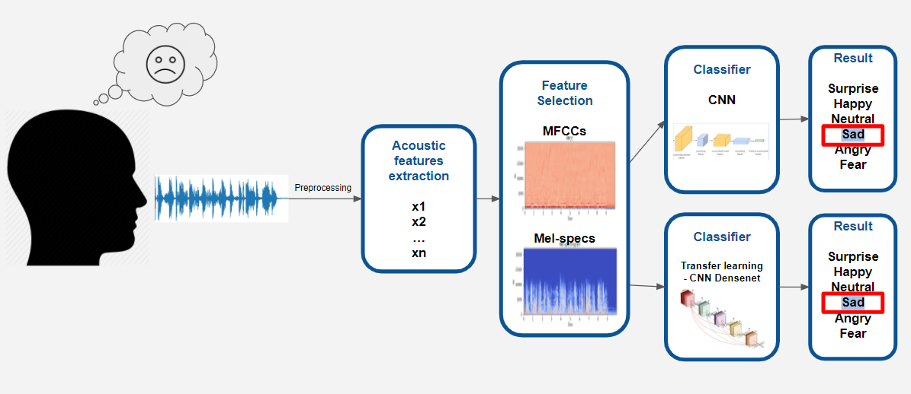
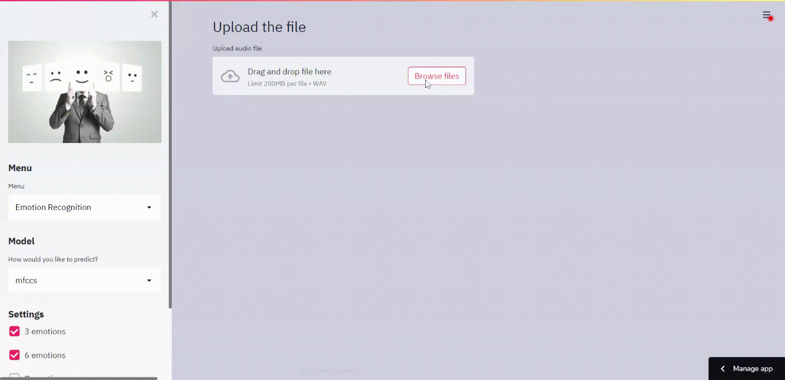

# Speech Emotion Recognition  

Web-application based on ML model for recognition of emotion for selected audio file. You can try it on [streamlit sharing platform](https://share.streamlit.io/cybermaryver/speech-emotion-webapp/app.py) or on [amazon server](http://34.217.207.244:8501/)


## Description
This project is a part of the final **Data Mining** project for **ITC Fellow Program 2020**. 

Datasets used in this project
* Crowd-sourced Emotional Mutimodal Actors Dataset (**Crema-D**)
* Ryerson Audio-Visual Database of Emotional Speech and Song (**Ravdess**)
* Surrey Audio-Visual Expressed Emotion (**Savee**)
* Toronto emotional speech set (**Tess**)

Digital signal processing is an emerging field of research in this era. Recently, many researchers have developed a various approaches in this area for SER from over the past decade.

Typically, the SER task is divided into two main sections: features selection and classification. The discriminative features selection and classification method that correctly recognizes the emotional state of the speaker in this domain is a challenging task

*Our project pipeline*


Nowadays, mostly researchers utilize deep learning techniques for SER using Mel-scale filter bank speech spectrogram as an input feature. A spectrogram is a 2-D representation of speech signals which is widely used in convolutional neural networks (CNNs) for extracting the salient and discriminative features. Similarly, we can utilize the transfer learning strategies for SER using speech spectrograms passing through pre-trained CNNs models like VGG, DenseNet or Alex-Net. 

Mel-Frequency Cepstral Coefficients, which are a representation of the short-term power spectrum of a sound by transforming the audio signal, are also considered to be an important feature for SER.

The Mel scale is important because it better approximates human-based perception of sound as opposed to linear scales. In filter-source theory, "the source is the vocal cords and the filter represents the vocal tract." The length and shape of the vocal tract determine how sound is outputted from a human and the cepstrum can describe the filter. 

In our project we have combined two models: pretrained DenseNet for mel-spectrograms and CNN for mfccs. 
You can find a more detailed description, EDA and ML models [**here**](https://github.com/talbaram3192/Emotion_Recognition)

## Installation

It is recommended to use the provided `requirements.txt` file to set your virtual environment.

To install the app run this commands

```sh
!git clone https://github.com/CyberMaryVer/speech-emotion-webapp.git
!cd speech-emotion-webapp
!python -m virtualenv your_venv
!your_venv/Scripts/activate
!pip install -r requirements.txt
```
After that you can run the app
```sh
!streamlit run app.py
```
## Usage
Example of an execution:

You can try the app [here](https://share.streamlit.io/cybermaryver/speech-emotion-webapp/app.py)



## Contributing
Pull requests are welcome. For major changes, please open an issue first to discuss what you would like to change.

## Team

[](https://github.com/CyberMaryVer) | [](https://github.com/talbaram3192) | [](https://github.com/asher1112)
--- | --- | ---
[Maria Startseva](https://github.com/CyberMaryVer) | [Tal Baram](https://github.com/talbaram3192) | [Asher](https://github.com/asher1112)

## License
**Speech Emotion Recognition Project** is released under the [MIT License](http://www.opensource.org/licenses/MIT).